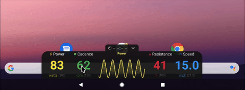

# grupetto fork: Enhanced overlay for Gen 2 Peloton Bikes

> **This is a fork of [selalipop/grupetto](https://github.com/selalipop/grupetto).** For installation instructions, detailed usage, and technical implementation details, please see the [original repository](https://github.com/selalipop/grupetto).

## Nov 2025 Updates

This fork includes the following enhancements:

- **Color-coded metrics** - Power (Yellow), Cadence (Green), Resistance (Red), Speed (Blue)
- **Interactive charts** - Click any metric to view its historical chart
- **Dedicated minimize/expand button** - Arrow icon replaces tap-anywhere-to-minimize
- **Max value tracking** - Displays max values next to units (e.g., "watts (150)"), auto-resets after 5 minutes of inactivity
- **Metric icons** - Visual icons next to each metric label on the expanded overlay
- **Resistance unit** - Now displays % symbol

## Compatibility

This fork was tested on **Android 11**. Compatibility with other Android versions is unknown.

## Installation

Download the APK from the [Releases](https://github.com/lowrykun/grupetto/releases) tab and sideload it onto your Peloton. See the [original repository](https://github.com/selalipop/grupetto#installation) for detailed sideloading instructions.

---

***Note: This project is wholly unaffiliated with Peloton. Please do not approach them for support with this app.***
